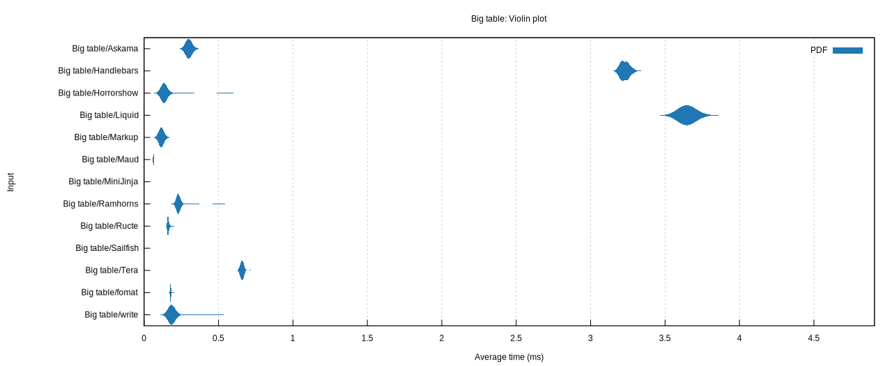
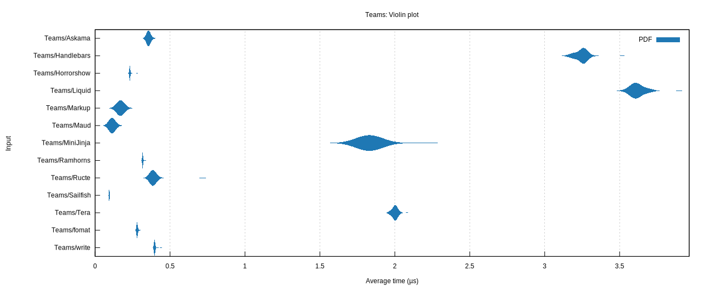

# Rust template engine benchmarks

This repo tries to assess Rust template engine performance. Templating engines are grouped into two broad categories:

## Compiled Templates

> These engines require you to rebuild when a template changes.

- [write!][write]: The std library `write!` macro
- [Askama][askama]: Type-safe, compiled Jinja-like templates for Rust
- [Horrorshow][horrorshow]: A macro-based html builder for rust
- [Ructe][ructe]: Rust Compiled Templates with static-file handling
- [fomat][fomat]: Alternative syntax for printing macros in Rust
- [Markup][markup]: A blazing fast, type-safe template engine for Rust
- [Maud][maud]: Compile-time HTML templates for Rust
- [Sailfish][sailfish]: Simple, small, and extremely fast template engine for Rust

[write]: https://doc.rust-lang.org/std/macro.write.html
[askama]: https://github.com/djc/askama
[horrorshow]: https://github.com/Stebalien/horrorshow-rs
[ructe]: https://github.com/kaj/ructe
[fomat]: https://github.com/krdln/fomat-macros
[markup]: https://github.com/utkarshkukreti/markup.rs
[maud]: https://github.com/lambda-fairy/maud
[sailfish]: https://github.com/Kogia-sima/sailfish

## Runtime Templates

> These engines do not require a rebuild of your rust codebase when a template changes.

- [Handlebars][handlebars]: Rust templating with Handlebars
- [Tera][tera]: A template engine for Rust based on Jinja2/Django
- [Liquid][liquid]: Liquid templating for Rust
- [MiniJinja][minijinja]: A powerful but minimal dependency template engine for Rust compatible with Jinja/Jinja2
- [Ramhorns][ramhorns]: Fast Mustache template engine implementation in pure Rust

[handlebars]: https://github.com/sunng87/handlebars-rust
[tera]: https://github.com/Keats/tera
[liquid]: https://github.com/cobalt-org/liquid-rust
[minijinja]: https://github.com/mitsuhiko/minijinja
[ramhorns]: https://github.com/maciejhirsz/ramhorns

## Results

> These results are from Oct 4, 2024 (rustc 1.81.0), running on an MacBook Pro 16 (M1 Pro)

As a [violin plot] generated by [Criterion]:

[violin plot]: https://en.wikipedia.org/wiki/Violin_plot
[Criterion]: https://japaric.github.io/criterion.rs/



```
Compiled:
Big table/write         time:   [184.09 µs 184.65 µs 185.23 µs]
Big table/Askama        time:   [301.07 µs 312.39 µs 331.58 µs]
Big table/Horrorshow    time:   [136.25 µs 142.29 µs 150.23 µs]
Big table/Ructe         time:   [160.09 µs 161.40 µs 163.04 µs]
Big table/fomat         time:   [177.22 µs 177.92 µs 178.62 µs]
Big table/Markup        time:   [115.97 µs 119.46 µs 124.76 µs]
Big table/Maud          time:   [62.113 µs 62.316 µs 62.519 µs]
Big table/Sailfish      time:   [16.435 µs 16.495 µs 16.583 µs]

Runtime:
Big table/Handlebars    time:   [3.2255 ms 3.2312 ms 3.2372 ms]
Big table/Tera          time:   [659.13 µs 663.30 µs 668.73 µs]
Big table/Liquid        time:   [3.6458 ms 3.6648 ms 3.6928 ms]
Big table/MiniJinja     time:   [618.52 ns 639.94 ns 684.72 ns]
Big table/Ramhorns      time:   [229.09 µs 234.91 µs 244.36 µs]
```



```
Compiled:
Teams/write             time:   [396.62 ns 397.35 ns 398.10 ns]
Teams/Askama            time:   [355.20 ns 357.99 ns 362.03 ns]
Teams/Horrorshow        time:   [230.91 ns 232.11 ns 234.06 ns]
Teams/Ructe             time:   [383.72 ns 398.63 ns 420.88 ns]
Teams/fomat             time:   [279.27 ns 279.94 ns 280.73 ns]
Teams/Markup            time:   [168.36 ns 169.51 ns 171.64 ns]
Teams/Maud              time:   [112.54 ns 112.97 ns 113.56 ns]
Teams/Sailfish          time:   [94.049 ns 94.650 ns 95.421 ns]

Runtime:
Teams/Handlebars        time:   [3.2577 µs 3.2621 µs 3.2663 µs]
Teams/Tera              time:   [1.9999 µs 2.0037 µs 2.0076 µs]
Teams/Liquid            time:   [3.6255 µs 3.6374 µs 3.6487 µs]
Teams/MiniJinja         time:   [1.8406 µs 1.9110 µs 2.0208 µs]
Teams/Ramhorns          time:   [316.34 ns 316.90 ns 317.46 ns]
```

## Running the benchmarks

```bash
./run-bench.sh
```

Plots will be rendered if `gnuplot` is installed and will be available in the `target/criterion` folder.
